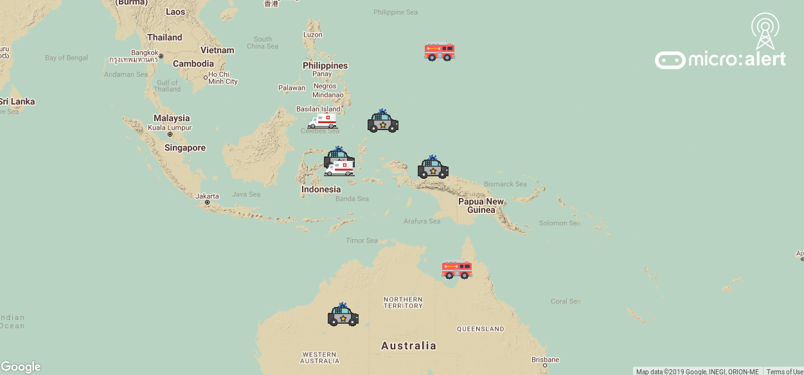

A basic implementation of a mesh network using low-power, low-cost micro:bit devices for disaster reporting. Created for Visa Graduate Hackathon, January 2019.

[thekeshavgoel](https://github.com/thekeshavgoel) || [HartBlanc](https://github.com/HartBlanc) || [salmansamie](https://github.com/salmansamie)

### How the network works

The mesh is built up of BBC micro:bit devices, each allowing the user to send a message via a selection of emergency service required. Once the message is broadcast from the origin, it is picked up by surrounding devices and passed on until it reaches the base station, connected to the internet. Once the basestation receives the message and posts it to AWS, it broadcasts an ACK which is propogated back through the network.

### Why

* Communication in disaster situations is hard, and traditional GSM is extremely high-overhead and doesn't scale well with high load in close-proximity.
* Devices that offer GPS capability are expensive, and have lower market penetration in areas where they'd be most useful
* Mobile phones have high power consumption, and are likely to be more fragile than a more primitive device with a battery life of months, not days.

### GUI

To run the GUI, simply load the site at [psedge.github.io/microalert](https://psedge.github.io/microalert), or open index.html locally.

